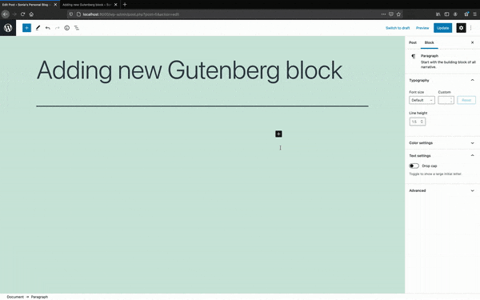
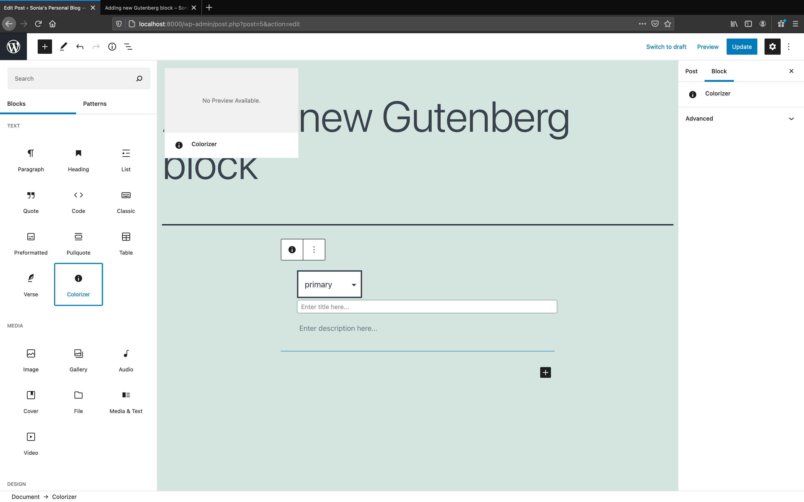
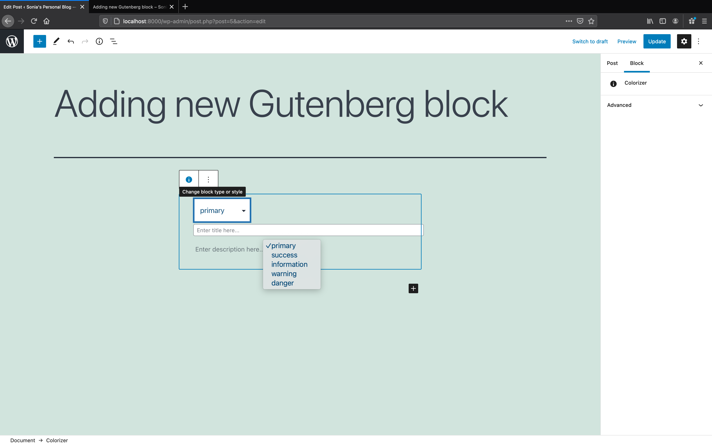
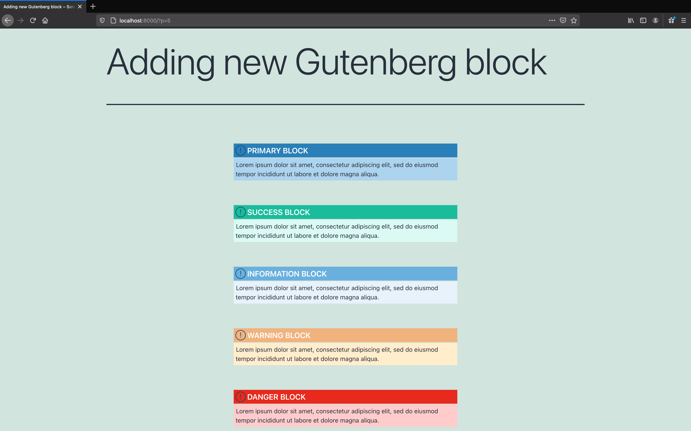

# 🎨 Gutenberg Colorizer Block

## Overview

As we know the Guternberg follows the block-system approach, and it introduces an entirely new way of customizing blocks in wordpress, moreover on the user-end/content creators, it gives an amazing opportunity to create the layouts and templates out of the box. 

As part of the assignment, I created a new block named **Gutenberg Colorizer Block**, it provides the users the ability to use different types of information box in their blogs according to their requirement whether they want to show Warning Box, Success Box etc. The Gutenberg Colorizer block features colored blocks, a title, followed by the summary, and it acts as a highlight in the content.




## Installation

1. Install [Docker](https://docs.docker.com/engine/install/) and [Docker Compose](https://docs.docker.com/compose/install/).
2. Clone this repository.
3. Start wordpress container by running the command 
```bash
docker-compose up -d
```
4. Activate the `Gutenberg Colorizer Block` on [`http://localhost:8000/wp-admin/plugins.php`](http://localhost:8000/wp-admin/plugins.php)
5. Get your wordpress container up and running at [http://localhost:8000/wp-admin](http://localhost:8000/wp-admin)
**(Note: The WordPress site is not immediately available on port 8000 because the containers are still being initialized and may take a couple of minutes before the first load)**


## Source Code for Gutenberg Colorizer Block

All code for my Gutenburg Colorizer block can be found in  [`wp-content/plugins/gutenberg-colorizer-block`](https://github.com/soniasingla/wp/tree/main/wp-content/plugins/gutenberg-colorizer-block) folder.

1. [`block.js`](https://github.com/soniasingla/wp/blob/main/wp-content/plugins/gutenberg-colorizer-block/block.js) contains the code for rendering the blocks in editor and storing the data.
2. [`block.css`](https://github.com/soniasingla/wp/blob/main/wp-content/plugins/gutenberg-colorizer-block/block.css) contains the CSS for different boxes of the block
3. [`plugin.php`](https://github.com/soniasingla/wp/blob/main/wp-content/plugins/gutenberg-colorizer-block/plugin.php) contains the meta data of the block and rendering functions of the block in editor.

## Navigating Project

I started Wordpress setup locally using [Docker Official Documentation](https://docs.docker.com/compose/wordpress/). After that I started reading about `Gutenberg`, `Gutenberg blocks` and the workflow following from [official Documentation guidelines](https://developer.wordpress.org/block-editor/). I have experience developing Firefox Extensions so I got the idea pretty quickly. After that I followed up with the [tutorials](https://developer.wordpress.org/block-editor/handbook/tutorials/) to get the basic ideas. Then I developed my customized block named **Gutenberg Colorizer Block** and then have to find out how to integrate the block into the Editor. For that refernce, I debugged the existing `Hello Dolly Plugin` by looking how this is rendering in wordpress, after that I put my plugin code in [`wp-content/plugins`](./wp-content/plugins) folder, activated, and further followed up with the developemnt of block. 

The whole process I followed for navigating the Gutenberg codebase is as follow:

1. Setup Wordpress locally using [Docker Official Docs](https://docs.docker.com/compose/wordpress/)
2. Read about Gutenberg Blocks from [Official Docs](https://wordpress.org/plugins/ultimate-addons-for-gutenberg/).
3. Played around the [tutorials](https://developer.wordpress.org/block-editor/handbook/tutorials/) to gain the working knowledge of the block editor. 
4. Debugged wordpress source code for how to integrate plugin in editor.


<p align="center">
  
</p>

5. Integrated my plugin in editor.

<p align="center">
  
</p>

6. Tested my plugin in editor.

<p align="center">
  
</p>
